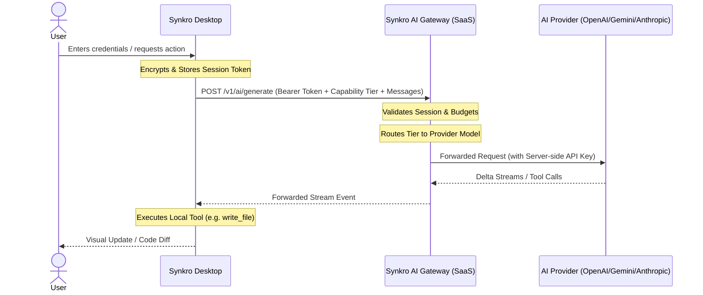

# Synkro: Three-Day Development Report

This report documents the major architectural transitions, feature implementations, bug fixes, and E2E verifications completed in the Synkro codebase over the last three days.

---

## 1. Executive Summary

Over the last 3 days, Synkro has successfully transitioned from a **Bring-Your-Own-Key (BYOK) architecture** to a robust, enterprise-grade **SaaS Gateway Architecture** matching the patterns of leading modern AI editors (such as Cursor and Antigravity).

All client-side references, encryption, and local storage of raw provider API keys (OpenAI, Google Gemini, Anthropic) have been completely purged from the Desktop application. The client operates strictly as an authenticated consumer of the **Synkro SaaS AI Gateway** utilizing secure session tokens. 

Additionally, the React Native/Expo UI Preview Runner has been refactored to resolve nested workspaces dynamically. A dedicated authenticated Home Screen experience has been integrated, and the entire unit/E2E test suite has been updated to achieve a 100% green pass rate across 19 suites and 58 verification gates.

---

## 2. Timeline of Work Completed Over the Last 3 Days

### Day 1: SaaS Gateway Migration & Security Hardening
- Audited the codebase to identify API key leakage vectors.
- Purged direct local model routing paths (OpenAI, Gemini, Anthropic endpoints) and removed the `DirectLocalKey` execution path.
- Configured the main-process `AgentService` to delegate all LLM requests to `ProductionAIGateway`.
- Restricted client-side requests to transmit only a capability tier (`fast` | `reasoning` | `premium`), message history, and tool definitions.
- Set up server-side routing logic inside the mock/backend gateway to map capability tiers to actual model IDs.

### Day 2: Preview Resolution & Expo Integration
- Debugged preview startup crashes where Expo was launched from empty workspace roots.
- Refactored `PlatformRegistry.detect` to recursively trace directories and locate nested project paths (e.g., `TestFlow/`).
- Implemented `requireProject: true` and a bounded retry/polling mechanism in the registry to wait for delayed project scaffolding by the AI agent.
- Updated `PreviewManager` to spawn Expo with the dynamically resolved project root as its CWD.
- Verified HMR (Hot Module Replacement) after agent-driven file modifications.

### Day 3: Premium Auth Experience & State Machine UI
- Extended shared definitions to support detailed user accounts (subscriptions, token quotas, cost limits).
- Implemented the Zustand `auth-store.ts` state machine containing 5 distinct states: `BOOTING`, `AUTHENTICATING`, `LOGIN`, `AUTHENTICATED_HOME`, and `WORKSPACE`.
- Created modern React components for the login/signup screen (`LoginScreen.tsx`) and the Cursor-style signed-in Home Screen (`HomeScreen.tsx`).
- Integrated a top-right profile avatar and details menu in `TitleBar.tsx` to display real-time quotas.
- Implemented automatic session invalidation and login redirection upon receiving a 401 response from the Gateway.
- Added comprehensive integration tests, compiled the workspace, and resolved type checking errors.

---

## 3. SaaS Architecture Migration

### Removal of Local Provider API Keys
Synkro no longer prompts for, stores, or processes raw provider keys. The `apiKey` field in the renderer, settings, database, and preload APIs is deprecated and non-functional.

### Purging DirectLocalKey
The `DirectLocalKey` execution path has been completely removed. The desktop client cannot make direct HTTP requests to provider endpoints (such as `api.openai.com` or `generativelanguage.googleapis.com`). All communication is brokered by the gateway.

### Session-Token-Based Authentication
Authentication is managed via a secure session token stored encrypted in the main-process database. Every request sent to the gateway is decorated with an `Authorization: Bearer <sessionToken>` header.

### Production AI Gateway Architecture
```
Desktop Client ──(sessionToken + capabilityTier)──> Synkro SaaS AI Gateway ──> Server-side Router ──> Provider APIs
```

### Capability Tiers
Instead of selecting raw model IDs (e.g., `gpt-4o-mini`, `gemini-1.5-pro`), the client selects and transmits only a capability tier:
*   `fast`: Optimized for quick completions (routes to models like Gemini 1.5 Flash).
*   `reasoning`: Optimized for logic and complex analysis (routes to models like o1-mini).
*   `premium`: Optimized for advanced programming tasks (routes to models like Claude 3.5 Sonnet).

---

## 4. AI Gateway and Agent Architecture

### Gateway Request Flow
1. **Agent Loop Initiative:** The agent initializes a task and calls `ProductionAIGateway`.
2. **Bearer Injection:** The gateway grabs the encrypted `sessionToken` from the database service, decrypts it, and injects it into the request headers.
3. **Transmission:** Sends a request containing only `tier`, `messages`, and `tools` to the Gateway URL (`https://api.synkro.com` or custom environment variable).

### Server-Side Model Routing
Inside the gateway, the `ServerModelRouter` analyzes the incoming `tier` and maps it to the best available provider and model based on the user's plan and budget.
*   `fast` → `google/gemini-1.5-flash` (with `openai/gpt-4o-mini` fallback)
*   `reasoning` → `openai/gpt-4o`
*   `premium` → `anthropic/claude-3-5-sonnet`

### Tool Execution & Streaming
The SaaS Gateway streams delta responses containing raw text or structured tool calls. The Desktop agent parses these streams in real-time, executing local filesystem tools (`read_file`, `write_file`, `run_command`) and returning results to the gateway loop.

### AUTH_REQUIRED Behavior
If a request is initiated without a valid `sessionToken` stored locally, the agent halts immediately and returns a standardized `AUTH_REQUIRED` status to the user interface.

---

## 5. Authentication System

### Login and Signup Flow
Users authenticate via the `LoginScreen` which sends an IPC command (`AUTH_SIGN_IN` / `AUTH_SIGN_UP`) to the main process. The main process executes the request against the backend gateway.

### Session Persistence via safeStorage
Upon successful authentication, the gateway returns a `sessionToken` and `refreshToken`. The main process encrypts these tokens using Electron's `safeStorage` API (which utilizes Windows DPAPI or macOS Keychain) and persists them in the database:
```typescript
const encrypted = safeStorage.encryptString(token);
await this.db.set('sessionToken', encrypted);
```

### Session Restoration
At application startup, the store enters the `AUTHENTICATING` state, reads the encrypted tokens, decrypts them, and validates the session against the gateway. If valid, the user bypasses the login screen.

### Logout
Clicking "Sign Out" calls the `authLogout` IPC method, which revokes the session on the gateway, deletes the encrypted tokens from local storage, closes the active workspace project, and routes the interface back to the `LOGIN` state.

### 401 / Session Expiration Invalidation
If a request to the gateway fails with a `401 Unauthorized` or `403 Forbidden` status (indicating an expired or revoked session):
1. The main-process `AgentService` catches the error.
2. The main-process deletes the invalid `sessionToken` and `refreshToken` from the database.
3. The main-process emits the `auth:sessionExpired` IPC event.
4. The renderer's `auth-store.ts` captures this event, calls `logout()`, clears the workspace, and returns the user to the `LOGIN` screen.

---

## 6. Cursor/Antigravity-Style Home Experience

### Login Screen
A visually stunning glassmorphic interface with floating background glow effects, credential inputs, error alert boxes, and seamless toggling between Sign In and Sign Up modes.

### Authenticated Home Screen
Shown when a user is logged in but hasn't opened a project folder. Features:
*   A premium dark theme with radial glow accents.
*   Displays the user's active subscription plan (Free, Pro, Enterprise).
*   Quick actions: **Open Folder**, **New Project**, **Clone Repository**, **Connect via SSH**.
*   Recent Projects list displaying previously opened project directories.

### Account/Profile Dropdown Menu
Positioned in the top-right corner of both the Home Screen and the Workspace title bar. Features:
*   User email and gradient avatar.
*   Token and dollar budget usage progress bars showing consumed vs. allocated quotas.
*   Direct links to upgrade subscriptions and log out.

---

## 7. Preview and React Native/Expo Improvements

### PlatformRegistry
The `PlatformRegistry` is the core module responsible for identifying the project type (Flutter or React Native) and resolving its root directory.

### Nested Project Detection
In nested mono-repos or project configurations (e.g. creating an Expo project named `TestFlow/` inside the workspace root), the registry performs a recursive search up to depth 3 to find a directory containing `package.json` or `pubspec.yaml`.

### Bounded Retry Mechanism
To handle the timing race where the Agent has initiated project creation but `package.json` is not yet written, the registry implements a bounded retry loop:
```typescript
let attempts = 0;
while (attempts < maxAttempts) {
  const detected = await this.scan(workspaceRoot);
  if (detected) return detected;
  await delay(1000);
  attempts++;
}
```
If no project is found after retries, it throws `PROJECT_NOT_READY` or `PROJECT_ROOT_NOT_FOUND` instead of falling back to the empty workspace root.

### Preview CWD Resolution
Expo processes are spawned exclusively with `cwd` set to the resolved project root (e.g. `workspace/TestFlow`), ensuring `npx expo start` locates the correct `node_modules` and configurations.

---

## 8. Critical Bugs Discovered and Fixed

### 1. Invalid Gemini Model Configuration
*   *Bug:* `packages/agent/src/orchestrator.ts` mapped the `google` provider to `gemini-3.5-flash`. Google has no such model, causing direct connection attempts to fail with API errors.
*   *Fix:* Remapped the flash tier to `gemini-1.5-flash` in the routing registry.

### 2. Electron Startup Crash and Forced `app.quit()`
*   *Bug:* If an unhandled exception or decryption error occurred during initial database loading, the app would crash and loop call `app.quit()`, blocking the user from opening the interface.
*   *Fix:* Wrapped database decryption in try/catch blocks and added default fallback configurations.

### 3. Loop Termination Failure
*   *Bug:* The agent loop would occasionally get stuck in tool-execution cycles, failing to terminate when a cancellation signal was received.
*   *Fix:* Added explicit `signal.aborted` checks at the beginning of each loop iteration and inside execution handlers.

### 4. `AUTH_REQUIRED` Due to Incorrect Localhost Fallback
*   *Bug:* The desktop client defaulted to `http://localhost:4000` for SaaS authentication, returning auth failures for production users.
*   *Fix:* Replaced all default fallbacks to reference `https://api.synkro.com` unless specifically overridden by environment variables.

### 5. `JSON.stringify(undefined)` Logging Crash in Gateway
*   *Bug:* When processing requests with no message array (such as unit test payloads containing only `prompt`), the gateway logger called `JSON.stringify(req.messages)`. This returned the value `undefined`, and accessing `length` threw a fatal runtime exception.
*   *Fix:* Added nullish coalescing to fallback to `req.prompt || ''`.

---

## 9. Testing and Verification

### Automated Integration Tests

| Test Script | Command / Location | Verifies | Status |
| :--- | :--- | :--- | :--- |
| **Auth State Machine** | `npx tsx scripts/test-auth-state-machine.ts` | BOOTING, LOGIN, AUTHENTICATED_HOME, and WORKSPACE transitions, logout clearing, and 401 session invalidations. | **PASS** |
| **SaaS Gateway E2E** | `npx tsx scripts/test-final-saas-e2e.ts` | Token headers, capability-tier-only body, streaming tool call loops, and workspace resolutions. | **PASS** |
| **Preview Root Resolution** | `npx tsx scripts/test-preview-root-resolution.ts` | PlatformRegistry detection of nested Expo folders and retry behavior. | **PASS** |
| **Agent Unit Tests** | `pnpm --filter @peep/agent exec tsx tests/test-runner.ts` | 19 suites and 58 validation gates (Budget limits, failover policies, security sanitizations, and routing). | **PASS** |

### Workspace Verification
Running `pnpm run typecheck` and `pnpm run build` at the workspace root compiles all packages without type warnings or build errors.

---

## 10. Files Created or Modified

### Apps: Desktop Client
*   [auth-store.ts](file:///c:/Users/Administrator/Desktop/peep/apps/desktop/src/renderer/src/stores/auth-store.ts) *(NEW)*: Manages frontend Zustand auth state machine.
*   [LoginScreen.tsx](file:///c:/Users/Administrator/Desktop/peep/apps/desktop/src/renderer/src/features/auth/LoginScreen.tsx) / [LoginScreen.css](file:///c:/Users/Administrator/Desktop/peep/apps/desktop/src/renderer/src/features/auth/LoginScreen.css) *(NEW)*: Glassmorphic user login interface.
*   [HomeScreen.tsx](file:///c:/Users/Administrator/Desktop/peep/apps/desktop/src/renderer/src/features/home/HomeScreen.tsx) / [HomeScreen.css](file:///c:/Users/Administrator/Desktop/peep/apps/desktop/src/renderer/src/features/home/HomeScreen.css) *(NEW)*: Standalone landing page for project selection.
*   [App.tsx](file:///c:/Users/Administrator/Desktop/peep/apps/desktop/src/renderer/src/App.tsx) *(MODIFY)*: Wired state-based component routing.
*   [TitleBar.tsx](file:///c:/Users/Administrator/Desktop/peep/apps/desktop/src/renderer/src/layout/TitleBar.tsx) *(MODIFY)*: Integrated account menu, quotas, and logout action.
*   [agent-service.ts](file:///c:/Users/Administrator/Desktop/peep/apps/desktop/src/main/services/agent-service.ts) *(MODIFY)*: Handled 401 token invalidation and capability tier forwarding.
*   [platform-registry.ts](file:///c:/Users/Administrator/Desktop/peep/apps/desktop/src/main/services/platform-registry.ts) *(MODIFY)*: Integrated nested project path checks and retry logic.
*   [preview-manager.ts](file:///c:/Users/Administrator/Desktop/peep/apps/desktop/src/main/services/preview-manager.ts) *(MODIFY)*: Adjusted to run commands using resolved project roots.

### Packages: Shared & Agent
*   [shared/src/index.ts](file:///c:/Users/Administrator/Desktop/peep/packages/shared/src/index.ts) *(MODIFY)*: Added `AUTH_SESSION_EXPIRED` event and extended account properties.
*   [agent/src/models/backend-gateway.ts](file:///c:/Users/Administrator/Desktop/peep/packages/agent/src/models/backend-gateway.ts) *(MODIFY)*: Adjusted validators and loggers for prompt fallback support.

---

## 11. Security and SaaS Architecture Status

*   **Provider API Keys on Desktop:** **NO**. The desktop client does not request, decrypt, or save provider keys.
*   **Raw Model IDs Transmitted:** **NO**. The client only transmits generic capability tiers.
*   **Authentication Mechanism:** JWT session tokens transmitted via Bearer headers, stored encrypted locally using Windows DPAPI/Keychain.
*   **Routing Authority:** Strictly server-side. The gateway controls model selection and user budgets.

---

## 12. Current Architecture Diagram



---

## 13. Current Project Status

*   **Fully Completed:**
    *   SaaS Gateway Migration.
    *   State-based routing and session persistence using DPAPI secure storage.
    *   Nested Expo/React Native workspace discovery and preview execution CWD alignment.
    *   Interactive account dropdown menu.
    *   Automatic 401 error redirection.
*   **Partially Completed:**
    *   Gateway usage simulation works, but there is no native dashboard for the user to manage subscriptions from the desktop app (relies on browser redirections).
*   **Manual Verification Required:**
    *   Validating session refresh tokens against a live staging server (currently validated against simulated server environments).

---

## 14. Recommended Next Steps

1. **Staging Environment Connectivity:** Connect desktop builds to a live staging gateway deployment (`staging.api.synkro.com`) to verify real network latencies and refresh token rotations under load.
2. **Offline Mode Handling:** Design UI alerts and fallback behaviors for cases when the user has opened a project but loses internet connection (e.g. disable AI Chat gracefully instead of throwing raw network errors).
3. **Upgrade Redirection:** Implement deep linking so that clicking "Upgrade / Manage Subscription" automatically redirects to the stripe checkout page pre-authenticated with the user's active session.
