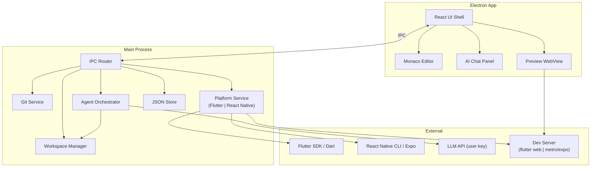

# Peep — Mobile-First AI Desktop IDE

**Working name:** Peep  
**Tagline:** *The AI desktop IDE for mobile developers*  
**Positioning:** Cursor understands code. Peep understands code + how the app looks + how it runs — for **Flutter and React Native**.

---

## 1. Product Requirements Document (PRD)

### 1.1 Problem Statement

Professional mobile developers today split attention across:

- A general-purpose IDE (VS Code, Android Studio, Xcode)
- Terminal / build tools
- Emulator or simulator
- A separate AI chat (ChatGPT, Cursor in another window)

The iteration loop — **prompt → code change → see result → fix** — is fragmented. Preview is never the center. AI doesn't deeply understand Flutter widget trees or React Native component hierarchies, navigation, or mobile project structure.

### 1.2 Product Definition

A **local-first desktop application** that unifies:

| Zone | Purpose |
|------|---------|
| Left | File explorer, search, Git |
| Center | Live phone-frame preview (hero) |
| Right | AI agent with file-editing tools |
| Bottom | Terminal, build output, errors (collapsible) |
| Overlay/tabs | Full Monaco code editor when editing |

**Not** a no-code builder. **Not** a full Android Studio/Xcode replacement in v1.

### 1.3 Target Users

| Persona | Needs |
|---------|-------|
| Solo Flutter freelancer | Fast screen generation, preview, ship |
| React Native developer | Component scaffold, Metro preview, AI fixes |
| Small team (2–8) | Shared conventions, Git, readable diffs |
| Agency dev | Templates, rapid prototyping, multi-platform |
| Senior mobile engineer | Full code access, safe AI edits, no lock-in |

### 1.4 Success Metrics (MVP)

| Metric | Target (90 days post-launch) |
|--------|------------------------------|
| Time to first preview | < 3 min from install |
| Preview refresh after save | < 5 s |
| AI edit acceptance rate | > 60% of proposed diffs applied |
| Weekly active projects opened | 2+ per active user |
| Crash-free sessions | > 99% |
| NPS (beta) | > 40 |
| React Native project opens | > 20% of total sessions by month 3 |

### 1.5 User Stories (MVP — prioritized)

**P0 — Must ship**

1. As a dev, I open or create a Flutter **or React Native** project locally.
2. As a dev, I browse and edit any project file in Monaco with tabs, search, undo/redo.
3. As a dev, I see a live phone-frame preview that updates after code changes.
4. As a dev, I ask the AI to create/modify a screen and review a diff before applying.
5. As a dev, I see build/analysis errors inline and in a panel.
6. As a dev, I run basic platform commands (analyze, pub get, metro, pod install) from the app.
7. As a dev, I initialize Git and see status; commit from a basic UI.

**P1 — Soon after MVP**

8. As a dev, I pick device frames (iPhone 15, Pixel 8, etc.).
9. As a dev, I generate a project from a prompt using templates (Flutter or React Native).
10. As a dev, I use keyboard shortcuts to switch editor ↔ preview ↔ chat.
11. As a RN dev, I see the Metro bundler status inline.

**P2 — Post-MVP**

12. Hot reload closer to native Flutter experience.
13. React Native Hermes debugger integration.
14. Widget inspector lite (Flutter) / Component tree (React Native).
15. Multi-file AI refactors with dependency awareness.

### 1.6 Functional Requirements

#### Project Management

- Detect project type automatically: `pubspec.yaml` → Flutter, `package.json` + RN deps → React Native
- Create new project: `flutter create` or `npx react-native init`
- Open existing folder as workspace
- Persist recent projects, last-opened files, platform type
- Detect Flutter SDK path + Node.js/RN CLI; validate on startup

#### Editor

- Monaco: Dart/Flutter syntax + JavaScript/TypeScript/JSX/TSX syntax
- Multi-tab, go-to-file (Ctrl+P), find in file/project
- Auto-save (configurable) + manual save
- Diff view for AI-proposed changes

#### AI Agent

- Tool-based agent (not chat-only)
- Tools: `read_file`, `list_dir`, `search`, `write_file`, `apply_patch`, `run_command` (allowlist), `analyze_errors`
- **Platform-aware system prompt**: Flutter mode (widgets, routes, state) OR React Native mode (components, navigation, Metro)
- Diff preview + explicit user approval for writes
- Conversation history per project
- Bring-your-own API key (OpenAI, Anthropic)

#### Preview

- **Flutter:** Flutter Web build served in embedded WebView
- **React Native:** Metro bundler → Expo Web or React Native Web preview in WebView
- Phone chrome overlay with realistic dimensions
- Manual refresh + auto-refresh on save (debounced)
- Show loading/error states in frame

#### Diagnostics

- **Flutter:** Parse `flutter analyze` output
- **React Native:** Parse TypeScript errors (`tsc --noEmit`) + ESLint output + Metro bundler errors
- Link errors to file:line in editor
- AI "suggest fix" on selected error

#### Git (basic)

- `git status`, stage, commit, diff view
- Branch display (read-only branches in MVP is acceptable)

### 1.7 Non-Functional Requirements

| Area | Requirement |
|------|-------------|
| Performance | App cold start < 5 s; UI 60 fps |
| Memory | Target < 500 MB idle (Electron acceptable for MVP) |
| Security | AI commands sandboxed; no arbitrary shell without confirm |
| Privacy | Local-first; code never leaves machine unless user sends to AI API |
| Offline | Editor works offline; preview needs platform CLI; AI needs network |
| Cross-platform | macOS + Windows first; Linux nice-to-have |

### 1.8 Explicit Non-Goals (MVP)

- Full Android emulator / iOS simulator replacement
- Xcode/Android Studio project editing for native modules (beyond opening folder)
- Plugin marketplace, cloud rendering, team collaboration
- Kotlin/Swift/native-only projects in v1

---

## 2. Technical Architecture Plan

### 2.1 Stack Decision

| Layer | Choice | Rationale |
|-------|--------|-----------| 
| Desktop shell | **Electron** (MVP) | Fastest path, mature Monaco/WebView, huge ecosystem |
| UI | **React 18 + TypeScript + Vite** | Team velocity, component model for complex layout |
| Editor | **Monaco Editor** | VS Code parity; Dart + JS/TS/JSX support |
| Local service | **Node.js** (Electron main + utility process) | CLI orchestration, file I/O, Git |
| State | **Zustand** (UI) + **JSON store** (projects, settings) | Simple, local persistence |
| AI | **Tool-calling agent** (custom loop) | Proven pattern from Cursor-like tools |
| Preview | **Embedded WebView** → platform dev server | Flutter Web or RN/Expo Web |
| Future shell | **Tauri** migration path | Design IPC boundaries now so swap is possible |

### 2.2 High-Level Architecture



### 2.3 Platform Adapter Architecture

The key abstraction that enables both Flutter and React Native:

```typescript
type PlatformTarget = 'flutter' | 'react-native' | 'expo';

interface PlatformAdapter {
  id: PlatformTarget;

  // Detection
  detectProject(root: string): Promise<boolean>;
  detectSdk(): Promise<SdkInfo | null>;

  // Build / run
  install(root: string): Promise<void>;           // pub get | npm install
  analyze(root: string): Promise<Diagnostic[]>;   // flutter analyze | tsc + eslint
  startPreview(root: string): Promise<PreviewSession>;
  stopPreview(session: PreviewSession): Promise<void>;
  reloadPreview(session: PreviewSession): void;   // hot reload signal

  // AI context
  getAgentContext(root: string): Promise<AgentContext>;
  getSystemPrompt(): string;

  // Templates
  listTemplates(): ProjectTemplateInfo[];
  createProject(name: string, parentPath: string, templateId: string): Promise<string>;
}
```

**Registered adapters:**
| Adapter | Status |
|---------|--------|
| `FlutterAdapter` | ✅ Built |
| `ReactNativeAdapter` | 🔄 Next sprint |
| `ExpoAdapter` | 📋 Planned (extends RN) |

### 2.4 AI Agent Architecture

```
User message
    → Platform-aware context builder
        Flutter: project tree, pubspec, main.dart, widget files, diagnostics
        React Native: package.json, App.tsx, navigation setup, Metro errors
    → LLM with tool definitions
    → Tool loop (max N iterations)
    → Proposed edits as unified diffs
    → User approval UI
    → Apply via Workspace Manager
    → Re-run analyze + refresh preview
```

**Tool allowlist for `run_command`:**

| Platform | Allowed commands |
|----------|----------------|
| Flutter | `flutter pub get`, `flutter analyze`, `flutter pub add`, `dart format` |
| React Native | `npm install`, `npx pod-install`, `npx tsc --noEmit`, `npx eslint` |
| Both | `git status`, `git add`, `git diff` |

**Context budget:**
- Project tree (paths only, depth 4)
- Platform manifest (`pubspec.yaml` or `package.json`)
- Entry point (`lib/main.dart` or `App.tsx`)
- Open file
- Semantic search (v2); MVP uses ripgrep via tool

### 2.5 Data Model

| Store | Fields |
|-------|--------|
| `projects` | id, path, name, lastOpened, platform (`flutter`\|`react-native`\|`expo`) |
| `settings` | flutterSdkPath, nodePath, rnCliPath, apiKey, model, theme, autoSave, onboardingCompleted, telemetryEnabled |
| `chat_sessions` | id, projectId, createdAt, title |
| `chat_messages` | id, sessionId, role, content, toolCallsJson |

### 2.6 Security Model

- API keys stored locally (never in plain logs)
- AI never auto-runs destructive Git or shell commands
- All file writes go through diff approval
- Content Security Policy on renderer; no `nodeIntegration` in renderer

---

## 3. Repository Structure

```
peep/
├── package.json
├── pnpm-workspace.yaml
├── tsconfig.base.json
│
├── apps/
│   └── desktop/
│       ├── src/
│       │   ├── main/                 # Electron main process
│       │   │   ├── index.ts
│       │   │   ├── ipc/
│       │   │   │   └── index.ts
│       │   │   ├── services/
│       │   │   │   ├── workspace-manager.ts
│       │   │   │   ├── flutter-service.ts        ✅
│       │   │   │   ├── react-native-service.ts   🔄 NEW
│       │   │   │   ├── platform-registry.ts      🔄 NEW
│       │   │   │   ├── git-service.ts            ✅
│       │   │   │   ├── terminal-service.ts       ✅
│       │   │   │   ├── agent-service.ts          ✅
│       │   │   │   ├── telemetry-service.ts      ✅
│       │   │   │   ├── auto-update-service.ts    ✅
│       │   │   │   ├── process-manager.ts        ✅
│       │   │   │   └── db.ts                     ✅
│       │   │   └── preload.ts
│       │   │
│       │   └── renderer/             # React UI
│       │       ├── App.tsx
│       │       ├── features/
│       │       │   ├── explorer/
│       │       │   ├── editor/
│       │       │   ├── preview/
│       │       │   ├── chat/
│       │       │   ├── git/          ✅
│       │       │   ├── terminal/     ✅
│       │       │   ├── diagnostics/
│       │       │   ├── onboarding/   ✅
│       │       │   ├── project/      ✅
│       │       │   ├── settings/     ✅
│       │       │   └── shared/       ✅ (EmptyState)
│       │       ├── stores/
│       │       │   ├── workspace-store.ts  ✅
│       │       │   ├── preview-store.ts    ✅
│       │       │   └── chat-store.ts       ✅
│       │       └── layout/
│       │           ├── AppShell.tsx  ✅
│       │           ├── TitleBar.tsx  ✅
│       │           ├── Sidebar.tsx   ✅
│       │           ├── EditorPane.tsx    ✅
│       │           ├── PreviewPane.tsx   ✅
│       │           ├── ChatPane.tsx      ✅
│       │           └── BottomPanel.tsx   ✅
│       └── package.json
│
├── packages/
│   ├── shared/               ✅ IPC types + channels
│   ├── platform-core/        ✅ PlatformAdapter interface
│   ├── agent/                ✅ AI agent stub
│   └── flutter-adapter/      ✅ Flutter diagnostics parser
│
├── templates/
│   └── flutter/
│       ├── blank/            ✅
│       ├── material-app/     ✅
│       └── bottom-nav-starter/ ✅
│   └── react-native/         🔄 NEW
│       ├── blank-rn/
│       ├── expo-tabs/
│       └── rn-navigation/
│
├── docs/
│   ├── PRODUCT_PLAN.md
│   ├── SPRINT_PROGRESS.md
│   └── ARCHITECTURE.md
│
└── scripts/
    └── dev.sh
```

---

## 4. MVP Feature List

### Ship checklist

| # | Feature | Platform | Status |
|---|---------|----------|--------|
| 1 | **Install & onboarding wizard** | Both | 🔄 In progress |
| 2 | **Create/open project** | Flutter ✅ / RN 🔄 | Partial |
| 3 | **File explorer** | Both | ✅ Done |
| 4 | **Monaco editor** (Tabs, Ctrl+P, save) | Both | ✅ Done |
| 5 | **Search** (Find in file + ripgrep) | Both | ✅ Done |
| 6 | **AI chat** (Streaming, project context) | Both | ✅ Done |
| 7 | **AI file edit** (Diff → apply/reject) | Both | ✅ Done |
| 8 | **Flutter Web preview** | Flutter | ✅ Done |
| 9 | **React Native / Expo Web preview** | RN | 🔄 Next |
| 10 | **Auto-refresh preview** (debounced on save) | Both | ✅ Done |
| 11 | **Error panel** (analyze + build errors) | Flutter ✅ / RN 🔄 | Partial |
| 12 | **AI fix suggestion** (click error → agent) | Both | ✅ Done |
| 13 | **Terminal** (flutter / npx / git commands) | Both | ✅ Done |
| 14 | **Git status + commit** | Both | ✅ Done |
| 15 | **Project from prompt** (AI scaffold) | Flutter ✅ / RN 🔄 | Partial |
| 16 | **Templates** | Flutter ✅ / RN 🔄 | Partial |
| 17 | **Settings** (API key, SDK paths, theme) | Both | ✅ Done |
| 18 | **Onboarding** (wizard, empty states) | Both | 🔄 In progress |
| 19 | **Auto-update** (electron-updater) | Both | 🔄 In progress |
| 20 | **Telemetry opt-in** (local, privacy-first) | Both | 🔄 In progress |
| 21 | **Platform auto-detection** | Both | 🔄 Next |
| 22 | **RN diagnostics parser** (tsc + eslint) | RN | 🔄 Next |
| 23 | **Metro bundler integration** | RN | 🔄 Next |
| 24 | **Device frame selector** | Both | 📋 Planned |
| 25 | **Eval set** (20 AI tasks tested) | Both | 📋 Planned |

### MVP UX flows (golden paths)

1. **Open existing Flutter app** → see preview in < 60 s
2. **Open existing React Native app** → Expo Web preview in < 60 s
3. **"Add a settings screen with dark mode toggle"** → diff → apply → preview updates
4. **Build fails** → error in panel → "Fix this" → agent patches → green analyze

---

## 5. Updated 12-Month Roadmap

| Month | Theme | Deliverables |
|-------|-------|--------------|
| **1** | Foundation ✅ | Monorepo, Electron shell, 4-panel layout, IPC |
| **2** | Workspace ✅ | File tree, Monaco, open/create Flutter project |
| **3** | AI v1 ✅ | Chat, BYOK, read-only tools |
| **4** | AI editing ✅ | Diff system, write tools, approval flow |
| **5** | Preview v1 ✅ | Flutter Web preview, phone frame |
| **6** | Loop closure ✅ | Auto-refresh, analyze, error → AI fix |
| **7** | Polish ✅ | Terminal, Git, templates, keyboard shortcuts |
| **8** | **React Native** 🔄 | RN adapter, Metro preview, RN templates, RN system prompt |
| **9** | Beta hardening 🔄 | Onboarding, empty states, auto-update, telemetry |
| **10** | Closed beta | 50–100 devs (Flutter + RN), feedback loops |
| **11** | Launch prep | Pricing, docs site, landing page, analytics |
| **12** | Public launch | v1.0, Pro tier, macOS + Windows installers |

### Post–month 12

| Quarter | Focus |
|---------|-------|
| Q2 Y2 | Expo managed workflow deep support, Riverpod/Bloc-aware agent |
| Q3 Y2 | Android Gradle adapter (emulator attach) |
| Q4 Y2 | iOS adapter (simulator attach), team features |

---

## 6. Recommended Team Structure

### Phase 1 — MVP (months 1–8): **5 people**

| Role | Ownership | FTE |
|------|-----------|-----|
| **Tech lead / full-stack desktop** | Electron, IPC, architecture, Monaco | 1 |
| **Flutter tools engineer** | Flutter service, preview, diagnostics | 1 |
| **React Native tools engineer** | RN adapter, Metro, Expo, RN diagnostics | 1 |
| **AI engineer** | Agent, prompts (Flutter + RN), tools, eval | 1 |
| **Product designer / QA** | Layout, flows, device frames, onboarding, testing | 1 |

### Phase 2 — Launch (months 9–12): **+2**

| Role | Why |
|------|-----|
| **DevOps / release** | Code signing, auto-update, CI, crash pipelines |
| **Developer advocate** | Docs, tutorials, community (Flutter + RN conferences) |

### Phase 3 — Growth (year 2): **8–12 total**

Add: Android platform engineer, technical writer, growth marketer, support engineer.

---

## 7. Risks & Mitigation

| Risk | Impact | Likelihood | Mitigation |
|------|--------|------------|------------|
| **Scope creep** (adding too many platforms) | Fatal delay | High | Flutter + RN only in Y1; strict adapter boundary |
| **RN preview complexity** (Metro + native modules) | Poor RN experience | High | Start with Expo Web (no native modules needed) |
| **Flutter Web preview ≠ real device** | User disappointment | High | Set expectations; document limitations |
| **Preview too slow** | Poor core loop | Medium | Debounce, incremental analyze |
| **AI generates bad mobile code** | Trust loss | High | Diffs, analyze before apply, platform-specific evals |
| **Electron memory/bloat** | Churn | Medium | Lazy-load Monaco; Tauri eval at month 10 |
| **SDK setup friction** (Flutter + Node + RN) | Drop-off at install | High | Smart auto-detection wizard |
| **Competing with Cursor + VS Code** | Weak differentiation | Medium | Preview-center + mobile prompts + platform-aware AI |
| **API cost** | Adoption blocker | Medium | BYOK default |

---

## 8. Pricing Strategy

### Model: **Freemium + Pro + BYOK**

| Tier | Price | Includes |
|------|-------|----------|
| **Free** | $0 | Full editor, preview, Git, terminal, BYOK AI, 50 requests/day |
| **Pro** | **$20–29/mo** | Unlimited agent, hosted credits, all templates (Flutter + RN), priority |
| **Team** | **$40–49/user/mo** | Shared templates, org billing, usage dashboard |
| **Enterprise** | Custom | Self-hosted LLM, air-gapped, SLA |

---

## 9. Launch Strategy

### Positioning

**Primary:** *The AI IDE for mobile engineers — Flutter and React Native*  
**Secondary:** *Build mobile screens 10x faster with AI that actually sees your app*

### Audience sequencing

1. **Flutter Discord / Reddit / X** — builders who feel preview pain daily
2. **React Native community** (Expo Discord, r/reactnative) — strong JS background
3. **YouTube** — "build a screen in 5 minutes" demos (Flutter + RN versions)
4. **Indie hackers** — Product Hunt, Hacker News "Show HN"
5. **Agencies** — cross-platform shops that use both Flutter and RN

---

## 10. Step-by-Step Implementation Plan

### Week 1–2: Bootstrap ✅
- [x] Init monorepo (pnpm, Electron + Vite + React + TS)
- [x] App shell: sidebar | center | right | bottom resizable panels
- [x] IPC bridge + typed contracts (`@peep/shared`)
- [x] JSON-based settings store

### Week 3–4: Workspace ✅
- [x] Open folder dialog, recent projects
- [x] File tree component + chokidar
- [x] Read/write file IPC
- [x] Monaco integration, single file tab

### Week 5–6: Editor polish ✅
- [x] Multi-tab, dirty state, save
- [x] Dart grammar + JS/TS/JSX syntax support
- [x] Ctrl+P file picker, find in file

### Week 7–8: Flutter integration ✅
- [x] SDK detection + settings UI
- [x] `flutter create` from template
- [x] `flutter pub get`, `flutter analyze`
- [x] Diagnostics parser → bottom panel

### Week 9–10: Preview ✅
- [x] Spawn `flutter run -d web-server`
- [x] WebView in phone frame component
- [x] Loading/error overlays
- [x] Manual refresh button

### Week 11–12: Preview loop ✅
- [x] File watcher → debounced reload
- [x] Port conflict handling
- [x] Stop/restart preview on project switch

### Week 13–14: AI chat (read-only) ✅
- [x] Chat UI with streaming
- [x] BYOK settings (API key stored locally)
- [x] Tools: list_dir, read_file, search_files, search_content
- [x] Flutter system prompt v1

### Week 15–16: AI editing ✅
- [x] Tools: propose_patch, apply_patch
- [x] Diff viewer component (unified diff)
- [x] Accept/reject per file + accept all
- [x] Post-apply analyze hook → preview refresh

### Week 17–18: Agent quality ⏳
- [x] Context builder (pubspec, main, tree, diagnostics, open file)
- [ ] Eval set: 20 common tasks (screen, fix error, add package)
- [x] Rate limit + error recovery in agent loop

### Week 19–20: Terminal + Git ✅
- [x] xterm.js bottom panel (session preserved across tab switches)
- [x] Allowlisted command runner (flutter, dart, git)
- [x] Git status, diff, stage, commit UI + branch display

### Week 21–22: Project from prompt ✅
- [x] Template library (3 Flutter starters: Blank, Material App, Bottom Nav)
- [x] New Project wizard with From Template + From Prompt modes
- [x] Agent scaffold flow: prompt → files → open project

### Week 23–24: Beta hardening ✅

- [x] Telemetry service (privacy-first, local-only logs)
- [x] Auto-update service (electron-updater, skip in dev)
- [x] Onboarding wizard component (Welcome → SDK → Telemetry → Done)
- [x] Empty state components (no project, no file, no API key, preview error)
- [x] Wire onboarding into App.tsx (show on first launch)
- [x] EmptyState CSS file
- [x] UpdateBanner component (show when update available)
- [ ] Code signing config (macOS notarization, Windows cert — CI/CD pipeline)

### Week 25–26: React Native Adapter ✅

- [x] `ReactNativeService` (detect RN/Expo project, `npm install`, `npx expo start --web`)
- [x] Platform auto-detection on folder open (`pubspec.yaml` → Flutter, `package.json` → RN)
- [x] RN diagnostics parser (`tsc --noEmit`, ESLint, Metro error parsing)
- [x] RN system prompt for AI agent (components, hooks, navigation, StyleSheet)
- [x] `PlatformRegistry` — route IPC calls to correct adapter
- [x] RN IPC channels registered in main process
- [x] RN template library (Blank RN, RN Tabs)
- [x] New Project wizard: add React Native / Expo options

### Week 27–28: RN Preview & Polish ✅
- [x] NewProjectModal: Flutter / React Native platform picker
- [x] Template filtering by platform
- [x] Platform-aware prompt placeholder text in "From Prompt" mode
- [x] PreviewPane: 5 device frames (iPhone 15, iPhone SE, Pixel 8, Pixel Fold, Galaxy S24)
- [x] Platform badge in preview header (🐦 Flutter / ⚛️ React Native)
- [x] Retry button on preview error
- [x] Device label below phone frame
- [x] Spinner animation for "Starting preview"
- [x] Keyboard shortcuts help modal (F1 / Shift+?)
- [x] Global shortcuts: Ctrl+P, Ctrl+,, Ctrl+N, F1
- [ ] Expo Web preview hot reload (Metro 'r' signal) — requires running RN project

### Week 29–30: Eval + Quality ✅

- [x] Eval set: 20 Flutter tasks (screens, widgets, fixes, refactors, packages, style)
- [x] Eval set: 20 React Native tasks (same categories)
- [x] Eval runner: automated scoring (pass/fail, category breakdown, summary printer)
- [x] Audit service: memory snapshot + project size/complexity classification
- [x] Audit IPC channels (performance snapshot, project audit)
- [x] SettingsModal: 4-tab layout (AI, SDK, Privacy/Telemetry, About)
- [x] Telemetry toggle in Privacy tab
- [x] About tab: version, memory info, check-for-updates button
- [x] Model selector dropdown (GPT-4o, GPT-4o mini, Claude)

### Definition of "MVP ready"

A new user can:
1. Install Peep, detect Flutter SDK or Node/RN CLI
2. Open **or create** a Flutter **or React Native** project
3. Ask the agent to add a screen
4. Approve the diff
5. See the result in the phone preview
— **without touching another app.**

✅ **MVP IS READY FOR BETA (Week 30 / Month 10)**

---

## 11. Month 10: Closed Beta Launch ✅

- [x] Landing Page (hero, features, comparison, pricing)
- [x] Beta signup form integrated into landing page
- [x] Weekly feedback form (NPS, CSAT, bug reports)
- [x] Beta Participant Guide (BETA_GUIDE.md)

---

## 12. React Native Adapter — Technical Design

### Project Detection

```typescript
async detectProject(root: string): Promise<boolean> {
  try {
    const pkgRaw = await readFile(join(root, 'package.json'), 'utf-8');
    const pkg = JSON.parse(pkgRaw);
    const deps = { ...pkg.dependencies, ...pkg.devDependencies };
    return 'react-native' in deps || '@react-navigation/native' in deps;
  } catch {
    return false;
  }
}
```

### Preview Strategy

| Approach | Pros | Cons |
|----------|------|------|
| **Expo Web** (`npx expo start --web`) | No native modules, fast, works in WebView | Expo-only projects |
| **React Native Web** (`webpack`) | Works with bare RN | Requires web setup |
| **Storybook Web** | Component-level preview | Not full app |

**MVP choice:** Expo Web (`npx expo start --web --port XXXX`) → load in WebView.  
Bare RN projects → guide user to add Expo or show terminal-only mode.

### RN System Prompt (additions to base prompt)

```
You are an expert React Native / Expo developer. 
Project uses: React Native {version}, Navigation: {react-navigation or expo-router}.
State: {detected: zustand/redux/context}.
Styling: StyleSheet (default) or {NativeWind/styled-components if detected}.

When modifying screens:
- Keep all StyleSheet objects at the bottom of the file.
- Use FlatList for lists, not map() on ScrollView (performance).
- Navigation: use useNavigation() hook, not prop drilling.
- Images: use require() for local assets.
- Never use inline styles for repeated elements.
```

### Allowlisted RN Commands

```
npx expo start --web
npx expo install <package>
npm install
npx react-native doctor
npx tsc --noEmit
npx eslint src --ext .ts,.tsx
npx pod-install (macOS only)
```

---

## ما يميزك عن Cursor

| Cursor | Peep |
|--------|------|
| General code intelligence | Mobile domain intelligence (Flutter + React Native) |
| Editor-centric | **Preview-centric** |
| User imagines UI | User **sees** UI in phone frame |
| Generic project understanding | Widget tree / component hierarchy, routes, pubspec/package.json |
| Broad language support | Deep Flutter + RN first, native later |
| One AI context for all | **Platform-aware AI** (different prompts per framework) |

---

## Critical Decisions — Answered

| Question | Decision |
|----------|----------|
| Business model at launch | BYOK first; hosted credits in month 10 |
| Target platform | Windows + macOS in parallel |
| Frameworks | **Flutter + React Native** (Expo-first for RN preview) |
| AI providers | OpenAI default, Anthropic optional |
| Open source strategy | Closed source MVP; open-core agent SDK later |
| Name | Keep **Peep** |
| RN preview approach | Expo Web (WebView-compatible, no native modules) |
